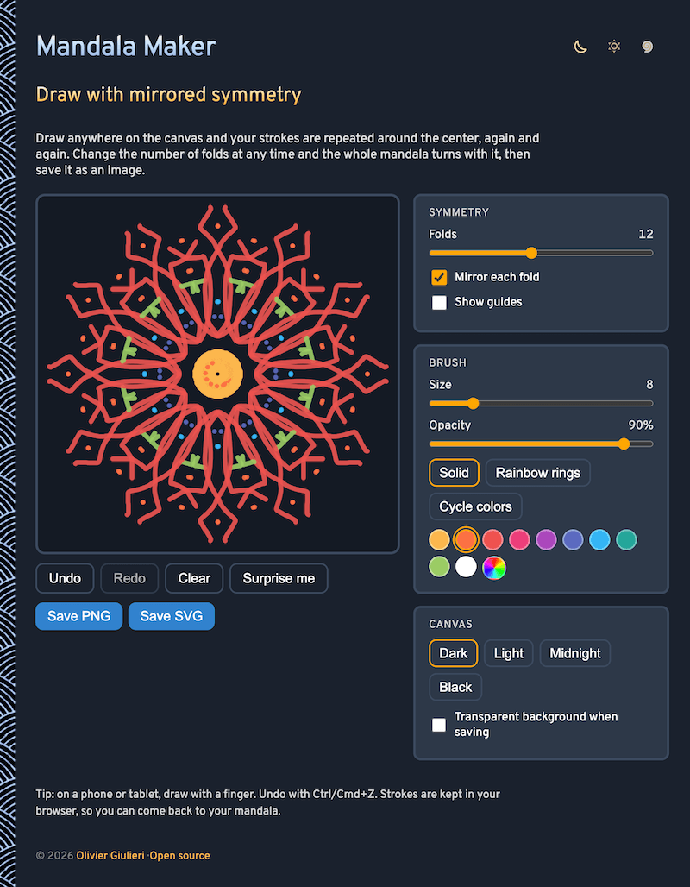

# Mandala-Maker

Draw a mandala right in your browser. Whatever you draw is repeated around the center and mirrored, so a few loose strokes become a symmetric design. Save it as a PNG or as an SVG. No sign-up and no libraries.

- [Make a mandala](https://evoluteur.github.io/mandala-maker/)

## What it does

Press and drag on the drawing area with a mouse, a finger or a pen. Each stroke is repeated in every fold, and, if **Mirror each fold** is on, flipped inside each fold too, which is what gives a mandala its petal look.

- **Folds**: from 2 to 24 repeats around the center (12 by default).
- **Brush**: size and opacity, in a color you pick from a palette, or in rainbow rings that change color with the distance from the center, or in a color that cycles from stroke to stroke.
- **Background**: dark, light, midnight or black, and an optional guide overlay that shows the fold lines.
- **Undo, redo and clear**, and **Surprise me** for a random starting design.
- **Save PNG** (2048 pixels square) or **Save SVG** (vector, so it prints at any size). Both can have a transparent background.

Your strokes and settings are kept in the browser's local storage, so reloading the page picks up where you left off.

## How it is built

The pages are plain HTML, CSS and JavaScript, with no dependencies and no build step. Just open `index.html`. It is also a small installable web app: add it to your home screen or desktop and it works offline.

- Strokes are stored in normalized coordinates, so the drawing stays the same when the window is resized.
- The canvas is redrawn from the stroke list, with an offscreen cache for speed. The SVG export writes each stroke once and repeats it with `use` elements.
- The app logic is in [js/mandala.js](https://github.com/evoluteur/mandala-maker/blob/main/js/mandala.js).
- Three color themes (dark, light and blue) are shared with my other projects.

There is also an [About mandalas](https://evoluteur.github.io/mandala-maker/about.html) page on what mandalas are, where they come from (Hindu and Buddhist traditions, Jung), and what research does and does not say about their effect on the mind.

Mandala-Maker is open source at [GitHub](https://github.com/evoluteur/mandala-maker) with MIT license.

Had fun browsing the app? [Buy me a coffee by becoming a sponsor](https://github.com/sponsors/evoluteur).

You may also be interested in my other projects [Labyrinth-Maker](https://github.com/evoluteur/labyrinth-maker) ([demo](https://evoluteur.github.io/labyrinth-maker/)), [Maze-Maker](https://github.com/evoluteur/maze-maker) ([demo](https://evoluteur.github.io/maze-maker/)), [Harmonograph-Maker](https://github.com/evoluteur/harmonograph-maker) ([demo](https://evoluteur.github.io/harmonograph-maker/)), [Sacred-Geometry](https://github.com/evoluteur/sacred-geometry) ([demo](https://evoluteur.github.io/sacred-geometry/)) and [Sri-Yantra](https://github.com/evoluteur/sri-yantra) ([demo](https://evoluteur.github.io/sri-yantra/)). See them all on [Esoterica](https://evoluteur.github.io/esoterica.html).

Copyright (c) 2026 [Olivier Giulieri](https://evoluteur.github.io/).
